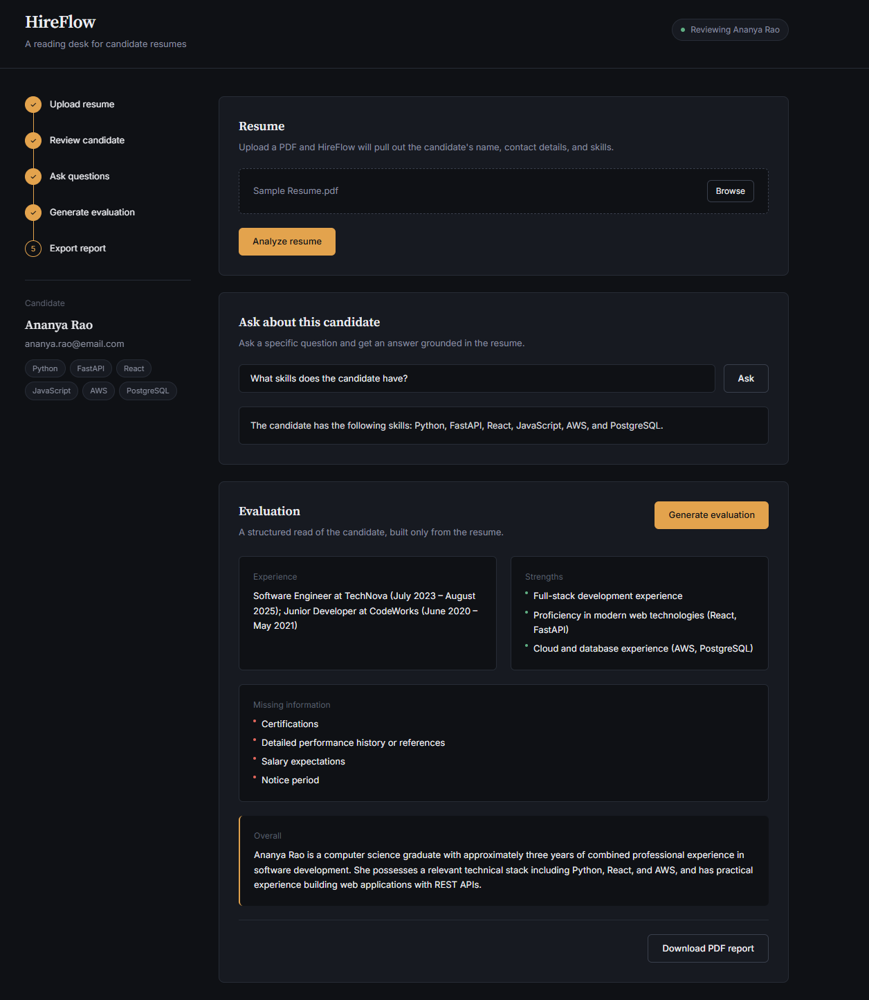

# HireFlow AI

AI-powered recruitment assistant with an automated HR evaluation workflow.

HireFlow AI processes a candidate resume, answers recruiter questions using the extracted information, and automatically generates a structured HR evaluation report.

## Workflow

Resume Upload → AI Extraction → Recruiter Q&A → AI Evaluation → HR Form Auto-Fill → PDF Generation

## Task 1: Resume Upload & Parsing

The recruiter uploads a candidate resume in PDF format.

The system:

1. Extracts text from the PDF using `pypdf`.
2. Sends the extracted resume content to Gemini AI.
3. Converts the resume into structured candidate information.

The extracted fields include:

- Name
- Email
- Phone
- Education
- Experience
- Skills
- Projects
- Certifications

## Task 2: AI Q&A

Recruiters can ask natural-language questions about the candidate.

Example:

> Does this candidate have experience with cloud technologies?

The AI answers using only the information extracted from the uploaded resume.

If the requested information is not available, the system responds that the information is not available instead of making assumptions.

## Task 3: Agentic HR Evaluation Workflow

The extracted candidate information is passed through an automated evaluation workflow.

The system:

1. Generates an AI-based candidate evaluation.
2. Maps the candidate information and evaluation into a mock HR evaluation form.
3. Generates the completed evaluation as a downloadable PDF.

The generated HR evaluation contains candidate details, education, experience, skills, projects, certifications, AI-generated strengths, missing information, and an overall evaluation.

### Agentic Flow

```text
Candidate Resume
       ↓
PDF Text Extraction
       ↓
AI Candidate Extraction
       ↓
Structured Candidate Data
       ↓
      ┌─────────────────────┐
      ↓                     ↓
Recruiter Q&A        AI Evaluation
      ↓                     ↓
      └──────────┬──────────┘
                 ↓
          HR Form Auto-Fill
                 ↓
          PDF Generation
                 ↓
        Downloadable Report
```

## System Design

```text
                    ┌───────────────────┐
                    │   Resume Upload    │
                    └─────────┬──────────┘
                              ↓
                    ┌───────────────────┐
                    │  PDF Text Parser  │
                    │       pypdf        │
                    └─────────┬──────────┘
                              ↓
                    ┌───────────────────┐
                    │     Gemini AI      │
                    │ Candidate Extract  │
                    └─────────┬──────────┘
                              ↓
                    ┌───────────────────┐
                    │  Structured Data   │
                    └─────────┬──────────┘
                              ↓
                 ┌────────────┴────────────┐
                 ↓                         ↓
          Recruiter Q&A             AI Evaluation
                 ↓                         ↓
                 └────────────┬────────────┘
                              ↓
                    ┌───────────────────┐
                    │   HR Form Agent    │
                    │     Auto-Fill       │
                    └─────────┬──────────┘
                              ↓
                    ┌───────────────────┐
                    │   ReportLab PDF    │
                    └─────────┬──────────┘
                              ↓
                    Downloadable Report
```

## API Endpoints

| Endpoint | Method | Purpose | Flow |
|---|---|---|---|
| `/` | GET | Backend health/status check | — |
| `/upload` | POST | Upload and parse a resume | PDF → pypdf → Gemini → Candidate Data |
| `/ask` | POST | Answer recruiter questions using candidate data | Question + Candidate Data → Gemini → Answer |
| `/evaluate` | POST | Generate structured AI candidate evaluation | Candidate Data → Gemini → Evaluation |
| `/create-hr-form` | POST | Auto-fill the mock HR evaluation form | Candidate Data + Evaluation → HR Form |
| `/generate-pdf` | POST | Generate the completed HR evaluation PDF | HR Form → ReportLab → PDF |

## Prompt Strategy

The prompts are designed to keep the AI grounded in the candidate's resume and reduce hallucinations.

- The extraction prompt instructs the model to use only information explicitly present in the resume.
- The model is instructed not to invent or assume candidate information.
- Missing information is represented using empty fields during extraction.
- Recruiter questions are answered using only the extracted candidate information.
- If information cannot be supported by the candidate data, the AI responds that the information is not available.
- Candidate extraction and evaluation use predefined JSON structures.
- The evaluation prompt also restricts the model to the provided candidate data.

This keeps the AI outputs traceable to the uploaded resume rather than relying on unrelated model knowledge.

## Technology Stack

- **Frontend:** React, Vite, Tailwind CSS
- **Backend:** Python, FastAPI
- **AI:** Google Gemini API
- **Resume Parsing:** pypdf
- **PDF Generation:** ReportLab


## Key Components

### `backend/main.py`

Defines the FastAPI application and exposes the API endpoints for:

- Resume upload
- Recruiter Q&A
- AI evaluation
- HR form generation
- PDF generation

### `backend/parser.py`

Extracts text from uploaded PDF resumes using pypdf.

### `backend/ai.py`

Contains the Gemini AI logic for:

- Candidate information extraction
- Recruiter Q&A
- Candidate evaluation

### `backend/agent.py`

Maps the extracted candidate information and AI evaluation into the mock corporate HR evaluation form.

### `backend/pdf_service.py`

Generates the final formatted HR evaluation PDF using ReportLab.

### `frontend/src/App.jsx`

Provides the recruiter-facing interface for:

- Uploading resumes
- Viewing extracted candidate information
- Asking questions
- Generating evaluations
- Downloading the final PDF


## Demo

The end-to-end application demonstrates:

**Resume Upload → AI Extraction → Recruiter Q&A → AI Evaluation → HR Form Auto-Fill → Downloadable PDF**


## Next Steps

With another week of development, the system could be extended with:

- OCR support for scanned and image-based resumes.
- Persistent candidate storage using MongoDB or PostgreSQL.
- Vector search / RAG for longer resumes and multiple candidate documents.
- Real SMTP/email dispatch to HR.
- Recruiter approval before final form submission.
- Multi-candidate management and recruiter sessions.
